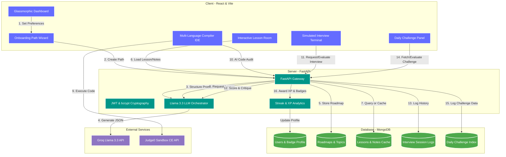

#  SkillForge - AI-Powered Skill Development & Learning Platform

  
  
  
  
  
  

---

### 🚀 **The complete platform to learn any skill from scratch to job-ready**

**SkillForge** is an advanced, production-ready, full-stack **Skill Development Platform** developed as an MCA Major Project. Unlike standard static roadmapping portals, SkillForge is a highly interactive, all-in-one ecosystem where learners can generate hyper-personalized curriculums, read dynamically synthesized AI lessons, take adaptive comprehension quizzes, compile and run code in an embedded multi-language IDE, practice live mock interview scenarios, and stay motivated through a robust gamified progression engine featuring XP points, daily challenges, and achievements badges.

---

## 🌟 The SkillForge Feature Ecosystem

### 🧠 1. Hyper-Personalized AI Roadmap Generation
- **5-Step Onboarding Wizard:** Seamlessly assesses the target skills, current proficiency levels (Beginner, Intermediate, Advanced), learning goals, and total timelines.
- **Topological JSON Curriculums:** Generates 8-16 well-sequenced topics mapping concepts from beginner fundamentals to job-ready expertise.
- **Curated Learning Resources:** Attaches direct links to high-quality external resources (video courses, documentations, code practices) for every milestone.

### 📖 2. Interactive AI Lessons & Dynamic Study Guides
- **Multi-Page Detailed Lessons:** Generates comprehensive, beginner-friendly textbooks for every single subtopic on the fly.
- **Rich Code Explanations:** Deep concept breakdown complete with line-by-line analyses of runnable, language-specific code snippets.
- **Study Notes Cache:** Generates and caches complete downloadable study booklets detailing common developer mistakes to avoid, core concepts, cheatsheets, and quick reflection checks.

### 💻 3. Embedded Multi-Language Compiler & Web IDE
- **Zero-Setup Local Sandbox:** Write, test, and compile software without downloading local tools or browsing multiple code playgrounds.
- **10 Supported Langs (via Judge0 CE Integration):** Fully run and debug **Python, JavaScript, Java, C, C++, C#, Go, Rust, TypeScript, and SQL** scripts with support for custom standard inputs (`stdin`).
- **Interactive Web Sandbox:** Features an automated side-by-side **HTML/CSS/JavaScript live viewport preview** in a sandboxed iframe.
- **Robotic Code Audit:** Paste script files and get instant, senior-developer-quality line-by-line code audits and feedback detailing logic bugs, stylistic optimizations, and a scoring grade out of 10.

### 📝 4. Adaptive Topic Quizzes & Knowledge Checks
- **Custom Question Synthesis:** Generates exactly 5 unique multiple-choice questions for every roadmap topic, targeting exact knowledge areas.
- **Progress Tracking Hook:** Score $\ge 60\%$ on a topic quiz to automatically mark the node complete in the roadmap database, unlock the next module, and award `+15 XP` points.
- **Detailed Explanations:** Explains why correct options are right and details why incorrect distractors are wrong.

### 🎙️ 5. Simulated Mock Interview Prep
- **Three Core Streams:** Prepare for career placements with targeted **Conceptual (Theory), Technical (Coding), or Behavioural** interview questions.
- **Candidate Answer Auditing:** Accepts written answers, assesses them strictly against a 1-10 scoring grid, determines pass/fail verdicts, lists exact strengths & gaps (quoting specific phrases the user typed), provides ideal model answer bullet points, and offers an actionable tip.
- **Session Archive:** Persists every practice attempt to an active user history profile for placement evaluation.

### 🏆 6. Gamification, Badges & Streaks
- **Daily Learning Streak Engine:** Calculates login date deltas to encourage consecutive day consistency and tracks active login counts.
- **GitHub-Style Contribution Heatmap:** Renders a gorgeous 365-day grid tracking daily platform interactions, completions, and submissions.
- **14 Achievements Badges:** Keeps users highly motivated through unlockable visual awards (e.g. *Pathfinder*, *Topic Master*, *Dedicated Learner*, *Roadmap Champion*, *Consistent*, *Week Warrior*, *Polymath*, *Interview Ready*, etc.).
- **Dynamic Daily Challenges:** Inspects the active learning topic context and creates a practical challenge tailored directly to their current learning path. Submitting the solution trigger automated senior dev critique audits and awards `+20 XP` points.

---

## 🏗️ System Architecture & Data Flow

The conceptual diagram below shows the interactions between the React frontend pages, secure FastAPI gateways, asynchronous MongoDB databases, and external Judge0 compile engines and Groq/Llama-3 LLM pipelines:

---

## 💻 Tech Stack & Dependencies

### Frontend (`/frontend`)
- **React 18** - Component-driven user interface.
- **Tailwind CSS** - Glassmorphic styling, dark modes, and micro-interactions.
- **Vite** - High-performance, instant hot-module reloading build system.
- **Axios & Context API** - Clean HTTP client routing and centralized state management.

### Backend (`/backend`)
- **FastAPI** - High-performance, modern Python web framework built on Starlette and Pydantic.
- **Uvicorn** - Lightning-fast ASGI web server implementation.
- **Motor** - Asynchronous Python driver for MongoDB.
- **Pydantic Settings** - Modern environment configuration management.
- **JWT (HS256) & bcrypt** - Production-standard encryption and security.
- **Groq API** - Asynchronous API integrations for low-latency JSON response formatting.

---

---

## 🔍 Core Algorithms & Platform Mechanics

| Core System Mechanic | Implementation Location | Engineering Utility |
| :--- | :--- | :--- |
| **Topological Prerequisite Ordering** | `ai_service.py` | Prompt engineering constraints forcing the LLM to structure topics with logical difficulty steps (`Beginner` → `Intermediate` → `Advanced`). |
| **Context-Based Content Filtering** | `ai_service.py` & `routes/features.py` | Adapts lessons, timeline sizes, resources, and question difficulty levels depending on onboarding inputs. |
| **Chronological Streak Engine** | `routes/auth.py` | Evaluates UTC timestamp intervals of consecutive logins. Awards daily streaks or resets dynamically. |
| **Double XP Gatekeeper (Idempotency)** | `routes/features.py` & `routes/quiz.py` | Prevents double XP awards on multiple quiz or challenge submissions using MongoDB document flag checks. |
| **Auto-Badge Validation Triggers** | `routes/quiz.py` | Automated post-event validation that updates user badge arrays when thresholds (streaks, completions, XP) are breached. |
| **Automated Data Expiration (TTL)** | `database.py` | MongoDB Time-To-Live index that purges daily challenge cache documents after exactly 5 days to optimize memory. |

---