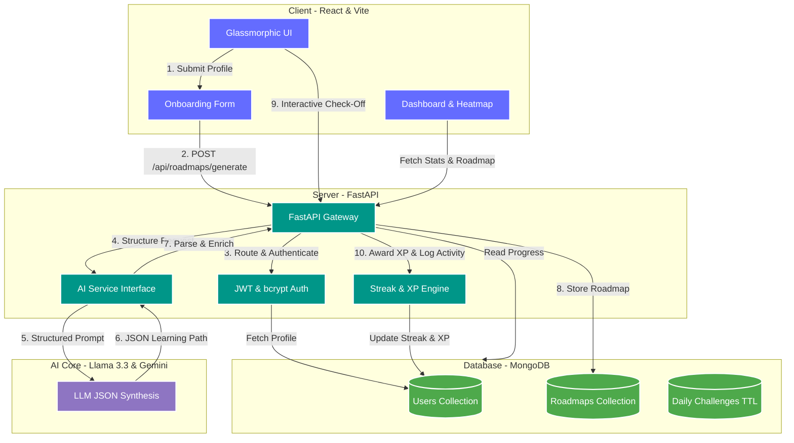

# 🌌 SkillForge — AI-Driven Personalized Learning Path Generator

<p align="center">
  <a href="https://github.com/muskan1024/SkillForge">
    
  </a>
  
  
  
  
</p>

---

### 🚀 **Empowering learners by turning static subjects into dynamic, AI-structured, gamified roadmap journeys.**

**SkillForge** is an advanced, full-stack web application developed as an MCA Major Project. It bridges the gap between chaotic online learning resources and organized, personalized educational paths. By combining a modern, interactive **React + Vite** frontend with a robust, high-performance **FastAPI** backend and asynchronous **MongoDB**, SkillForge queries state-of-the-art LLMs (Meta Llama 3.3 via Groq or Google Gemini 1.5 Flash) to generate comprehensive, week-by-week learning paths customized for any skill level, goal, and timeline.

---

## 🌟 Key Features

### 🧠 **Hyper-Personalized AI Roadmap Generation**
- **5-Step Interactive Onboarding:** Collects details about user skills, current skill level (Beginner/Intermediate/Advanced), target learning goals, and total timeline duration.
- **Precision JSON Synthesis:** Connects to LLM engines to generate structured learning plans containing 8–16 distinct topics, complete with estimated hours, day ranges, and sequenced difficulty.
- **Curated, Free Resources:** AI automatically links high-quality, free resources (YouTube videos, official documentation, interactive practices, and online courses) directly to each topic.

### 🎮 **Gamified Learning & Activity Metrics**
- **Chronological Login Streak Engine:** Tracks consecutive daily usage and displays login streaks.
- **XP Reward Progression:** Earn `+10 XP` for every topic completed, fostering continuous learning and motivation.
- **Visual Progress Trackers:** Real-time percentage bars showing overall course completion and relative progress.
- **Interactive Heatmap:** A GitHub-style 365-day contributions heatmap that visualizes daily learning consistency.

### 🗺️ **"You Are Here" Interactive Roadmap Navigator**
- **Dynamic Timeline Indicator:** Highlights the current active topic in the roadmap timeline so learners never lose track.
- **Adaptive Check-Offs:** Check off topics and mark them complete instantly, updating your dashboard analytics dynamically.
- **Multiple Track Management:** Create, manage, and toggle between multiple active roadmaps.

### 🔒 **Enterprise-Grade Architecture**
- **Secure Authentication:** JWT token authentication for secure, stateless sessions.
- **Cryptographic Security:** Hashed passwords using `bcrypt` with salt rounds.
- **Fast, Async Data Layer:** Motor async MongoDB driver prevents database call blocking.

---

## 🏗️ System Architecture & Data Flow

Below is the conceptual architecture of the SkillForge ecosystem, showing how the frontend, API gateways, database indexes, and AI service pipelines communicate:



---

## 💻 Tech Stack & Dependencies

### Frontend (`/frontend`)
- **React 18** — Component-driven user interface.
- **Tailwind CSS** — Glassmorphic styling, dark modes, and micro-interactions.
- **Vite** — High-performance, instant hot-module reloading build system.
- **Axios & Context API** — Clean HTTP client routing and centralized state management.

### Backend (`/backend`)
- **FastAPI** — High-performance, modern Python web framework built on Starlette and Pydantic.
- **Uvicorn** — Lightning-fast ASGI web server implementation.
- **Motor** — Asynchronous Python driver for MongoDB.
- **Pydantic Settings** — Modern environment configuration management.
- **JWT (HS256) & bcrypt** — Production-standard encryption and security.
- **Groq API / Google Gemini SDK** — Asynchronous API integrations for low-latency JSON response formatting.

---

## 📂 Project Structure

```
skillforge/
├── backend/
│   ├── main.py              ← FastAPI app entry
│   ├── database.py          ← MongoDB connection & async setup
│   ├── models.py            ← Pydantic schemas & request validators
│   ├── auth_utils.py        ← JWT tokens & bcrypt helper library
│   ├── ai_service.py        ← Groq/Llama-3 & Gemini AI prompt engineering
│   ├── requirements.txt     ← Backend Python dependencies
│   ├── .env.example         ← Standard configuration environment template
│   └── routes/
│       ├── auth.py          ← User register, login & profile lookup
│       ├── roadmaps.py      ← Roadmap generation, list, get, and delete routes
│       ├── progress.py      ← Topic completion tracker and XP award system
│       └── dashboard.py     ← Aggregate statistics, streaks, and calendar metrics
│
└── frontend/
    ├── src/
    │   ├── App.jsx            ← React Router configuration
    │   ├── main.jsx           ← Application entry point
    │   ├── index.css          ← Core styling system & Tailwind directives
    │   ├── context/
    │   │   └── AuthContext.jsx← Centralized token & session management
    │   ├── utils/
    │   │   └── api.js         ← Modular Axios custom instance
    │   ├── components/
    │   │   └── AppLayout.jsx  ← Sidebar sidebar skeleton and structural viewports
    │   └── pages/
    │       ├── Landing.jsx    ← Clean landing page with feature walkthroughs
    │       ├── Login.jsx      ← User authorization login screen
    │       ├── Register.jsx   ← Account registration viewport
    │       ├── Dashboard.jsx  ← Streak calendar, XP, active roadmap stats
    │       ├── Onboarding.jsx ← Dynamic 5-step AI learning wizard
    │       ├── RoadmapView.jsx← Fully detailed active roadmap with tracker nodes
    │       └── MyRoadmaps.jsx ← Overview repository of all user paths
    ├── package.json           ← Node package registry
    ├── vite.config.js         ← Vite development configurations
    ├── tailwind.config.js     ← Tailwind utility custom configurations
    └── index.html             ← Mount viewport shell
```

---

## 🔍 Core Algorithms & Methodologies

| Core Concept / Algorithm | Implementation Location | Engineering Utility |
| :--- | :--- | :--- |
| **Topological Prerequisite Ordering** | `ai_service.py` | Prompt-engineered rules forcing structured, logically ordered difficulty levels (`Beginner` → `Intermediate` → `Advanced`). |
| **Context-Based Content Filtering** | `ai_service.py` | Adapts resources, topic timeline density, and course depth depending on current skill level and target timeline. |
| **Chronological Streak Tracking** | `routes/auth.py` | Compares timestamp deltas on user logins to award consecutive daily streaks or reset gracefully. |
| **Stateless Session Control** | `auth_utils.py` | Uses cryptographic HMAC-SHA256 signatures to authorize request calls without stateful session overhead. |
| **Automated Data Expiration (TTL)** | `database.py` | Leverages MongoDB native Time-To-Live (TTL) index mechanics on temporary user challenges for optimal database maintenance. |
| **Progress Analytics Calculation** | `routes/progress.py` | $\text{Progress Percent} = \frac{\text{Completed Topics}}{\text{Total Topics}} \times 100$, tracking dynamic step adjustments dynamically. |

---

## 🔌 API Endpoints Reference

### Authentication Suite (`/api/auth`)
* `POST /api/auth/register` — Registers new profiles and issues access tokens.
* `POST /api/auth/login` — Verifies user credentials, calculates streak, and returns JWT.
* `GET /api/auth/me` — Fetches metadata of the currently signed-in user.

### Roadmap Management (`/api/roadmaps`)
* `POST /api/roadmaps/generate` — Contacts AI service to build and store a new personalized path.
* `GET /api/roadmaps/` — Lists all roadmap profiles created by the user.
* `GET /api/roadmaps/{id}` — Returns fully parsed topic nodes of a single roadmap.
* `DELETE /api/roadmaps/{id}` — Safely purges a learning roadmap from records.

### Progress & Dashboard (`/api/progress` & `/api/dashboard`)
* `POST /api/progress/topic` — Toggles completion status of a topic, updates XP points, and advances index metrics.
* `GET /api/dashboard/` — Gathers all user statistics, active tracks, and full-year activity heatmap values.

---

## 🛠️ Step-by-Step Installation

Follow these instructions to spin up the local development ecosystem:

### ⚙️ Prerequisites
Ensure you have the following installed on your machine:
- **Node.js** (v18 or higher)
- **Python** (v3.10 or higher)
- **MongoDB Community Server** (running locally or a cloud MongoDB Atlas connection URI)

---

### Step 1: Clone and Set Up Databases

1. Make sure your local MongoDB instance is started:
   ```bash
   # macOS (Homebrew)
   brew services start mongodb-community
   
   # Ubuntu / Linux Server
   sudo systemctl start mongod
   
   # Windows
   # Run MongoDB Windows Service under Services.msc
   ```

2. Generate your LLM API Key:
   - **Google Gemini:** Obtain a free key at [Google AI Studio](https://aistudio.google.com/app/apikey).
   - **Groq (Meta Llama):** Obtain a key at [Groq Console](https://console.groq.com/keys).

---

### Step 2: Configure & Launch the Backend

1. Navigate to the backend directory:
   ```bash
   cd skillforge/backend
   ```
2. Set up a Python Virtual Environment:
   ```bash
   python -m venv venv
   # Activate on Windows (PowerShell/CMD):
   venv\Scripts\activate
   # Activate on macOS/Linux:
   source venv/bin/activate
   ```
3. Install required libraries:
   ```bash
   pip install -r requirements.txt
   ```
4. Configure environment properties:
   ```bash
   cp .env.example .env
   ```
   Open the `.env` file and insert your respective values:
   ```env
   MONGODB_URL=mongodb://localhost:27017
   DB_NAME=skillforge
   JWT_SECRET=generate-a-strong-random-key-here
   JWT_ALGORITHM=HS256
   JWT_EXPIRE_MINUTES=10080
   GEMINI_API_KEY=your_gemini_key_if_used
   GROQ_API_KEY=your_groq_key_if_used
   ```
5. Spin up the FastAPI server:
   ```bash
   uvicorn main:app --reload --port 8000
   ```
   - The API documentation will be available at: http://localhost:8000/docs
   - The live API endpoints gateway will listen at: http://localhost:8000

---

### Step 3: Configure & Launch the Frontend

1. Navigate to the frontend directory:
   ```bash
   cd ../frontend
   ```
2. Install the necessary node modules:
   ```bash
   npm install
   ```
3. Boot up the Vite dev client:
   ```bash
   npm run dev
   ```
   - The user application dashboard will be live at: http://localhost:5173

---

## 🎯 Verification Plan

### Manual Verification
1. Open http://localhost:5173 on any modern browser.
2. Sign up as a new user (receives `0 XP`, `0` day streak).
3. Fill out the Onboarding wizard (e.g. Skills: "React, Node.js", Level: "Beginner", Goal: "Job-Ready Developer", Timeline: "4 Weeks").
4. Inspect the generated roadmap: verify that week allocations, descriptions, and resource links are loaded.
5. Check off some topics: verify XP updates to `+10 XP` and the progression bar fills.
6. Refresh the page or re-login: verify that your progress remains stored and the calendar activity updates.

### Automated Tests
- Swagger/OpenAPI docs are auto-compiled at `/docs` to execute requests interactively.
